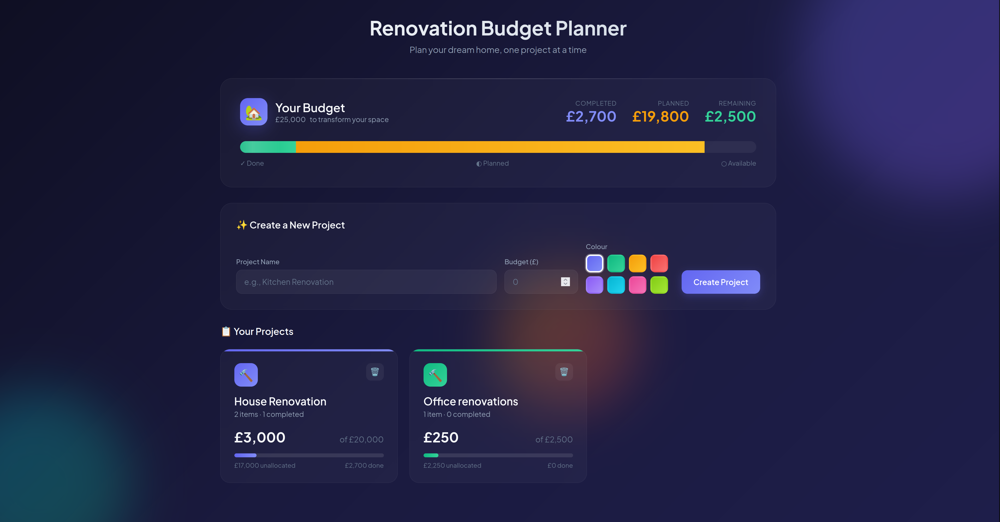

# Renovation Budget Planner

A delightful, visual budget planner for home renovations. Because spreadsheets are boring.



## Why?

Planning a home renovation with your partner shouldn't feel like doing taxes. Renovation Budget Planner turns budget allocation into something you actually *want* to look at — a visual overview of your money that you divvy up into projects, then break down into line items.

## Features

- **Visual Budget Overview** — See your total budget at a glance with animated progress bars showing committed vs. remaining funds
- **Project-Based Planning** — Create projects (Kitchen, Bathroom, Garden...) each with their own allocated budget
- **Line Items** — Break each project into specific items (worktops, tiles, labour) with costs
- **Completion Tracking** — Check off items as you complete them, with satisfying confetti celebrations
- **Editable Total Budget** — Click to change your total budget amount anytime
- **Colour-Coded Projects** — 8 gradient colours to visually distinguish your projects
- **Persistent Storage** — Everything saves to localStorage automatically
- **Fully Offline** — No server, no accounts, no tracking. Just a single HTML file.
- **Responsive Design** — Works on desktop and mobile

## Demo

Just open `index.html` in your browser. That's it.

Or serve it locally:

```bash
# Python 3
python -m http.server 8000

# Then visit http://localhost:8000
```

## How It Works

1. **Set your total budget** — Click the budget amount at the top to edit (default £20,000)
2. **Create projects** — Give each project a name, budget allocation, and colour
3. **Add items to projects** — Click into a project and add line items with costs
4. **Track progress** — Check off items as you complete them
5. **Celebrate** — Enjoy the confetti when you finish something!

## Tech Stack

- Vanilla HTML, CSS, JavaScript
- No build step, no dependencies, no frameworks
- Google Fonts (Plus Jakarta Sans)
- localStorage for persistence

## Customisation

Want to change the currency from GBP (£) to something else? Find and replace `£` in `index.html`.

Want different colours? Edit the `.color-option` elements and the `getLighterColor()` function in the JavaScript.

## Browser Support

Works in all modern browsers (Chrome, Firefox, Safari, Edge). Uses CSS features like `backdrop-filter` for the glassmorphism effect — older browsers will still work but may look slightly different.

## License

MIT — do whatever you want with it.

## Contributing

Found a bug? Have an idea? Open an issue or PR.

## Author

Built with help from [Claude](https://claude.ai).
